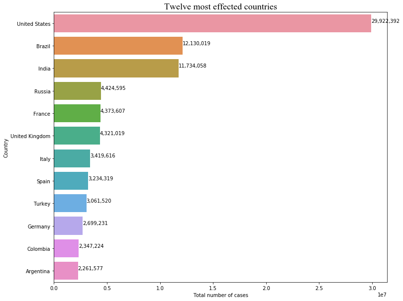

# Covid-19 and the response of the UK

>Coronavirus is perhaps the biggest peice of history we will live through, where your country of residence has huge implicaitons of your chances of dealing with lockdowns, death and the chance of a vaccination. With an exploration and analysis of the OWID Covid-19 data we can see how the UK compares to similar countries in terms of number of cases, excess mortality rates, political responses and vaccination rates. 

>Below we import all packages we will use for our visualisations


```python
%matplotlib inline
import matplotlib.pyplot as plt
import numpy as np
import pandas as pd
import seaborn as sns
import matplotlib.ticker
plt.rcParams['figure.facecolor'] = 'w'
from datetime import datetime
import matplotlib.dates as mdates
from matplotlib.dates import DateFormatter, WeekdayLocator
from datetime import timedelta
import plotly.express as px
```

### Data cleaning and preprocessing

>The data can now be read and filtered for just the useful columns before checking for duplicates. Due to the large data shape (76832x13), it will be more useful to drop missing values for individual columns when doing visualisations to avoid missing out on useful insights to the data as a whole.


```python
covid = pd.read_csv('owid-covid-data.csv')
covid_clean = covid.loc[:,covid.columns.intersection(['continent', 'location', 'date', 'total_cases', 'new_cases',
       'new_cases_smoothed', 'total_deaths',
       'new_deaths_smoothed', 'total_cases_per_million',
       'new_cases_per_million', 'new_cases_smoothed_per_million',
       'total_deaths_per_million',
       'people_vaccinated_per_hundred'])]
covid_clean.duplicated().sum()
covid_clean
```


<div>
<style scoped>
    .dataframe tbody tr th:only-of-type {
        vertical-align: middle;
    }

    .dataframe tbody tr th {
        vertical-align: top;
    }

    .dataframe thead th {
        text-align: right;
    }
</style>
<table border="1" class="dataframe">
  <thead>
    <tr style="text-align: right;">
      <th></th>
      <th>continent</th>
      <th>location</th>
      <th>date</th>
      <th>total_cases</th>
      <th>new_cases</th>
      <th>new_cases_smoothed</th>
      <th>total_deaths</th>
      <th>new_deaths_smoothed</th>
      <th>total_cases_per_million</th>
      <th>new_cases_per_million</th>
      <th>new_cases_smoothed_per_million</th>
      <th>total_deaths_per_million</th>
      <th>people_vaccinated_per_hundred</th>
    </tr>
  </thead>
  <tbody>
    <tr>
      <td>0</td>
      <td>Asia</td>
      <td>Afghanistan</td>
      <td>2020-02-24</td>
      <td>1.0</td>
      <td>1.0</td>
      <td>NaN</td>
      <td>NaN</td>
      <td>NaN</td>
      <td>0.026</td>
      <td>0.026</td>
      <td>NaN</td>
      <td>NaN</td>
      <td>NaN</td>
    </tr>
    <tr>
      <td>1</td>
      <td>Asia</td>
      <td>Afghanistan</td>
      <td>2020-02-25</td>
      <td>1.0</td>
      <td>0.0</td>
      <td>NaN</td>
      <td>NaN</td>
      <td>NaN</td>
      <td>0.026</td>
      <td>0.000</td>
      <td>NaN</td>
      <td>NaN</td>
      <td>NaN</td>
    </tr>
    <tr>
      <td>2</td>
      <td>Asia</td>
      <td>Afghanistan</td>
      <td>2020-02-26</td>
      <td>1.0</td>
      <td>0.0</td>
      <td>NaN</td>
      <td>NaN</td>
      <td>NaN</td>
      <td>0.026</td>
      <td>0.000</td>
      <td>NaN</td>
      <td>NaN</td>
      <td>NaN</td>
    </tr>
    <tr>
      <td>3</td>
      <td>Asia</td>
      <td>Afghanistan</td>
      <td>2020-02-27</td>
      <td>1.0</td>
      <td>0.0</td>
      <td>NaN</td>
      <td>NaN</td>
      <td>NaN</td>
      <td>0.026</td>
      <td>0.000</td>
      <td>NaN</td>
      <td>NaN</td>
      <td>NaN</td>
    </tr>
    <tr>
      <td>4</td>
      <td>Asia</td>
      <td>Afghanistan</td>
      <td>2020-02-28</td>
      <td>1.0</td>
      <td>0.0</td>
      <td>NaN</td>
      <td>NaN</td>
      <td>NaN</td>
      <td>0.026</td>
      <td>0.000</td>
      <td>NaN</td>
      <td>NaN</td>
      <td>NaN</td>
    </tr>
    <tr>
      <td>...</td>
      <td>...</td>
      <td>...</td>
      <td>...</td>
      <td>...</td>
      <td>...</td>
      <td>...</td>
      <td>...</td>
      <td>...</td>
      <td>...</td>
      <td>...</td>
      <td>...</td>
      <td>...</td>
      <td>...</td>
    </tr>
    <tr>
      <td>76827</td>
      <td>Africa</td>
      <td>Zimbabwe</td>
      <td>2021-03-19</td>
      <td>36652.0</td>
      <td>41.0</td>
      <td>32.714</td>
      <td>1510.0</td>
      <td>2.000</td>
      <td>2466.001</td>
      <td>2.759</td>
      <td>2.201</td>
      <td>101.595</td>
      <td>0.28</td>
    </tr>
    <tr>
      <td>76828</td>
      <td>Africa</td>
      <td>Zimbabwe</td>
      <td>2021-03-20</td>
      <td>36662.0</td>
      <td>10.0</td>
      <td>27.286</td>
      <td>1510.0</td>
      <td>1.286</td>
      <td>2466.674</td>
      <td>0.673</td>
      <td>1.836</td>
      <td>101.595</td>
      <td>0.28</td>
    </tr>
    <tr>
      <td>76829</td>
      <td>Africa</td>
      <td>Zimbabwe</td>
      <td>2021-03-21</td>
      <td>36665.0</td>
      <td>3.0</td>
      <td>25.857</td>
      <td>1512.0</td>
      <td>1.286</td>
      <td>2466.876</td>
      <td>0.202</td>
      <td>1.740</td>
      <td>101.730</td>
      <td>0.29</td>
    </tr>
    <tr>
      <td>76830</td>
      <td>Africa</td>
      <td>Zimbabwe</td>
      <td>2021-03-22</td>
      <td>36684.0</td>
      <td>19.0</td>
      <td>25.714</td>
      <td>1514.0</td>
      <td>1.429</td>
      <td>2468.154</td>
      <td>1.278</td>
      <td>1.730</td>
      <td>101.864</td>
      <td>0.29</td>
    </tr>
    <tr>
      <td>76831</td>
      <td>Africa</td>
      <td>Zimbabwe</td>
      <td>2021-03-23</td>
      <td>36717.0</td>
      <td>33.0</td>
      <td>26.000</td>
      <td>1516.0</td>
      <td>1.286</td>
      <td>2470.375</td>
      <td>2.220</td>
      <td>1.749</td>
      <td>101.999</td>
      <td>0.30</td>
    </tr>
  </tbody>
</table>
<p>76832 rows × 13 columns</p>
</div>


>Our analysis is based on comparison of the UK. For us to use the location data from OWID I have removed the collective coninent data. These figures are sums of all countries that fall in that region, therefore unnecessary for us to look at the impact on individul countries.


```python
country_index = covid.set_index('location')
countries = country_index.drop(['Africa','Asia','European Union','Europe','International','Oceania','South America','World','North America'])
```

> Lastly, it is important we change our date from series to datetime to be able to plot and analyse Covid-19 as a time series.


```python
covid['date']=pd.to_datetime(covid['date'])
```

### Most Impacted Countries

> In order to decide which countries we should base our comparison of the UK on, it's important to look into the most impacted countries:


```python
world = countries.groupby('location').max().reset_index()
top_12 = world.sort_values(by=['total_cases'], ascending=False).head(12)
top_12
```


<div>
<style scoped>
    .dataframe tbody tr th:only-of-type {
        vertical-align: middle;
    }

    .dataframe tbody tr th {
        vertical-align: top;
    }

    .dataframe thead th {
        text-align: right;
    }
</style>
<table border="1" class="dataframe">
  <thead>
    <tr style="text-align: right;">
      <th></th>
      <th>location</th>
      <th>iso_code</th>
      <th>continent</th>
      <th>date</th>
      <th>total_cases</th>
      <th>new_cases</th>
      <th>new_cases_smoothed</th>
      <th>total_deaths</th>
      <th>new_deaths</th>
      <th>new_deaths_smoothed</th>
      <th>...</th>
      <th>gdp_per_capita</th>
      <th>extreme_poverty</th>
      <th>cardiovasc_death_rate</th>
      <th>diabetes_prevalence</th>
      <th>female_smokers</th>
      <th>male_smokers</th>
      <th>handwashing_facilities</th>
      <th>hospital_beds_per_thousand</th>
      <th>life_expectancy</th>
      <th>human_development_index</th>
    </tr>
  </thead>
  <tbody>
    <tr>
      <td>196</td>
      <td>United States</td>
      <td>USA</td>
      <td>North America</td>
      <td>2021-03-23</td>
      <td>29922392.0</td>
      <td>300416.0</td>
      <td>250743.571</td>
      <td>543843.0</td>
      <td>4477.0</td>
      <td>3427.429</td>
      <td>...</td>
      <td>54225.446</td>
      <td>1.2</td>
      <td>151.089</td>
      <td>10.79</td>
      <td>19.1</td>
      <td>24.6</td>
      <td>NaN</td>
      <td>2.77</td>
      <td>78.86</td>
      <td>0.926</td>
    </tr>
    <tr>
      <td>25</td>
      <td>Brazil</td>
      <td>BRA</td>
      <td>South America</td>
      <td>2021-03-23</td>
      <td>12130019.0</td>
      <td>90570.0</td>
      <td>75416.714</td>
      <td>298676.0</td>
      <td>3251.0</td>
      <td>2364.143</td>
      <td>...</td>
      <td>14103.452</td>
      <td>3.4</td>
      <td>177.961</td>
      <td>8.11</td>
      <td>10.1</td>
      <td>17.9</td>
      <td>NaN</td>
      <td>2.20</td>
      <td>75.88</td>
      <td>0.765</td>
    </tr>
    <tr>
      <td>85</td>
      <td>India</td>
      <td>IND</td>
      <td>Asia</td>
      <td>2021-03-23</td>
      <td>11734058.0</td>
      <td>97894.0</td>
      <td>93198.571</td>
      <td>160441.0</td>
      <td>2003.0</td>
      <td>1168.000</td>
      <td>...</td>
      <td>6426.674</td>
      <td>21.2</td>
      <td>282.280</td>
      <td>10.39</td>
      <td>1.9</td>
      <td>20.6</td>
      <td>59.550</td>
      <td>0.53</td>
      <td>69.66</td>
      <td>0.645</td>
    </tr>
    <tr>
      <td>153</td>
      <td>Russia</td>
      <td>RUS</td>
      <td>Europe</td>
      <td>2021-03-23</td>
      <td>4424595.0</td>
      <td>29499.0</td>
      <td>28501.143</td>
      <td>94231.0</td>
      <td>624.0</td>
      <td>554.571</td>
      <td>...</td>
      <td>24765.954</td>
      <td>0.1</td>
      <td>431.297</td>
      <td>6.18</td>
      <td>23.4</td>
      <td>58.3</td>
      <td>NaN</td>
      <td>8.05</td>
      <td>72.58</td>
      <td>0.824</td>
    </tr>
    <tr>
      <td>65</td>
      <td>France</td>
      <td>FRA</td>
      <td>Europe</td>
      <td>2021-03-23</td>
      <td>4373607.0</td>
      <td>106091.0</td>
      <td>56225.286</td>
      <td>93064.0</td>
      <td>1438.0</td>
      <td>975.286</td>
      <td>...</td>
      <td>38605.671</td>
      <td>NaN</td>
      <td>86.060</td>
      <td>4.77</td>
      <td>30.1</td>
      <td>35.6</td>
      <td>NaN</td>
      <td>5.98</td>
      <td>82.66</td>
      <td>0.901</td>
    </tr>
    <tr>
      <td>195</td>
      <td>United Kingdom</td>
      <td>GBR</td>
      <td>Europe</td>
      <td>2021-03-23</td>
      <td>4321019.0</td>
      <td>68192.0</td>
      <td>59828.571</td>
      <td>126523.0</td>
      <td>1826.0</td>
      <td>1253.000</td>
      <td>...</td>
      <td>39753.244</td>
      <td>0.2</td>
      <td>122.137</td>
      <td>4.28</td>
      <td>20.0</td>
      <td>24.7</td>
      <td>NaN</td>
      <td>2.54</td>
      <td>81.32</td>
      <td>0.932</td>
    </tr>
    <tr>
      <td>92</td>
      <td>Italy</td>
      <td>ITA</td>
      <td>Europe</td>
      <td>2021-03-23</td>
      <td>3419616.0</td>
      <td>40902.0</td>
      <td>35072.571</td>
      <td>105879.0</td>
      <td>993.0</td>
      <td>814.286</td>
      <td>...</td>
      <td>35220.084</td>
      <td>2.0</td>
      <td>113.151</td>
      <td>4.78</td>
      <td>19.8</td>
      <td>27.8</td>
      <td>NaN</td>
      <td>3.18</td>
      <td>83.51</td>
      <td>0.892</td>
    </tr>
    <tr>
      <td>175</td>
      <td>Spain</td>
      <td>ESP</td>
      <td>Europe</td>
      <td>2021-03-23</td>
      <td>3234319.0</td>
      <td>93822.0</td>
      <td>37010.714</td>
      <td>73744.0</td>
      <td>1623.0</td>
      <td>865.714</td>
      <td>...</td>
      <td>34272.360</td>
      <td>1.0</td>
      <td>99.403</td>
      <td>7.17</td>
      <td>27.4</td>
      <td>31.4</td>
      <td>NaN</td>
      <td>2.97</td>
      <td>83.56</td>
      <td>0.904</td>
    </tr>
    <tr>
      <td>190</td>
      <td>Turkey</td>
      <td>TUR</td>
      <td>Asia</td>
      <td>2021-03-23</td>
      <td>3061520.0</td>
      <td>44506.0</td>
      <td>33307.143</td>
      <td>30316.0</td>
      <td>259.0</td>
      <td>255.143</td>
      <td>...</td>
      <td>25129.341</td>
      <td>0.2</td>
      <td>171.285</td>
      <td>12.13</td>
      <td>14.1</td>
      <td>41.1</td>
      <td>NaN</td>
      <td>2.81</td>
      <td>77.69</td>
      <td>0.820</td>
    </tr>
    <tr>
      <td>69</td>
      <td>Germany</td>
      <td>DEU</td>
      <td>Europe</td>
      <td>2021-03-23</td>
      <td>2699231.0</td>
      <td>49044.0</td>
      <td>25757.000</td>
      <td>75255.0</td>
      <td>1734.0</td>
      <td>894.429</td>
      <td>...</td>
      <td>45229.245</td>
      <td>NaN</td>
      <td>156.139</td>
      <td>8.31</td>
      <td>28.2</td>
      <td>33.1</td>
      <td>NaN</td>
      <td>8.00</td>
      <td>81.33</td>
      <td>0.947</td>
    </tr>
    <tr>
      <td>39</td>
      <td>Colombia</td>
      <td>COL</td>
      <td>South America</td>
      <td>2021-03-23</td>
      <td>2347224.0</td>
      <td>21078.0</td>
      <td>17857.000</td>
      <td>62274.0</td>
      <td>400.0</td>
      <td>391.857</td>
      <td>...</td>
      <td>13254.949</td>
      <td>4.5</td>
      <td>124.240</td>
      <td>7.44</td>
      <td>4.7</td>
      <td>13.5</td>
      <td>65.386</td>
      <td>1.71</td>
      <td>77.29</td>
      <td>0.767</td>
    </tr>
    <tr>
      <td>7</td>
      <td>Argentina</td>
      <td>ARG</td>
      <td>South America</td>
      <td>2021-03-23</td>
      <td>2261577.0</td>
      <td>18326.0</td>
      <td>15051.143</td>
      <td>54823.0</td>
      <td>3351.0</td>
      <td>788.857</td>
      <td>...</td>
      <td>18933.907</td>
      <td>0.6</td>
      <td>191.032</td>
      <td>5.50</td>
      <td>16.2</td>
      <td>27.7</td>
      <td>NaN</td>
      <td>5.00</td>
      <td>76.67</td>
      <td>0.845</td>
    </tr>
  </tbody>
</table>
<p>12 rows × 58 columns</p>
</div>


```python
top_12 = world.sort_values(by=['total_cases'], ascending=False).head(12)
plt.figure(figsize=(12,10))
plot = sns.barplot(top_12['total_cases'], top_12['location'])
for i,(value,name) in enumerate(zip(top_12['total_cases'],top_12['location'])):
    plot.text(value, i-0.05,f'{value:,.0f}', size=10)
plot.set(xlabel='Total number of cases', ylabel='Country')
plt.title('Twelve most effected countries', fontname='Times New Roman', fontsize =18, fontweight='bold')
plt.show()
```





>From here we can see the total number cases for the most effected countries. This gives us a basis on which countries are important to look at to complete our objective of making comparisons to the United Kingdom

> It is important to recognise that Covid-19 is a worldwide issue, and since some countries will have been largely effected with lower total cases due to small populations. Should you wish to look at the number of cases, below in an interactive choropleth graph which is an extension of our insights into the effected countries by cases, as a reader you can hover over any country of interest for the total number of cases.


```python
figure = px.choropleth(world,
                       locations='location', 
                       locationmode='country names', 
                       color='total_cases', 
                       hover_name='location', 
                       color_continuous_scale='tealgrn', 
                       range_color=[1,10000000],
                       title='Total cases in each Country')
figure.update_layout(autosize = False, width = 800, height = 800)
figure.show()
```


<div>                            <div id="74e368bd-6ee1-40df-b789-3b1d6ef2b591" class="plotly-graph-div" style="height:800px; width:800px;"></div>            <script type="text/javascript">                require(["plotly"], function(Plotly) {                    window.PLOTLYENV=window.PLOTLYENV || {};                                    if (document.getElementById("74e368bd-6ee1-40df-b789-3b1d6ef2b591")) {                    Plotly.newPlot(                        "74e368bd-6ee1-40df-b789-3b1d6ef2b591",                        [{"coloraxis": "coloraxis", "geo": "geo", "hovertemplate": "<b>%{hovertext}</b><br><br>location=%{location}<br>total_cases=%{z}<extra></extra>", "hovertext": ["Afghanistan", "Albania", "Algeria", "Andorra", "Angola", "Anguilla", "Antigua and Barbuda", "Argentina", "Armenia", "Australia", "Austria", "Azerbaijan", "Bahamas", "Bahrain", "Bangladesh", "Barbados", "Belarus", "Belgium", "Belize", "Benin", "Bermuda", "Bhutan", "Bolivia", "Bosnia and Herzegovina", "Botswana", "Brazil", "Brunei", "Bulgaria", "Burkina Faso", "Burundi", "Cambodia", "Cameroon", "Canada", "Cape Verde", "Cayman Islands", "Central African Republic", "Chad", "Chile", "China", "Colombia", "Comoros", "Congo", "Costa Rica", "Cote d'Ivoire", "Croatia", "Cuba", "Cyprus", "Czechia", "Democratic Republic of Congo", "Denmark", "Djibouti", "Dominica", "Dominican Republic", "Ecuador", "Egypt", "El Salvador", "Equatorial Guinea", "Eritrea", "Estonia", "Eswatini", "Ethiopia", "Faeroe Islands", "Falkland Islands", "Fiji", "Finland", "France", "Gabon", "Gambia", "Georgia", "Germany", "Ghana", "Gibraltar", "Greece", "Greenland", "Grenada", "Guatemala", "Guernsey", "Guinea", "Guinea-Bissau", "Guyana", "Haiti", "Honduras", "Hong Kong", "Hungary", "Iceland", "India", "Indonesia", "Iran", "Iraq", "Ireland", "Isle of Man", "Israel", "Italy", "Jamaica", "Japan", "Jersey", "Jordan", "Kazakhstan", "Kenya", "Kosovo", "Kuwait", "Kyrgyzstan", "Laos", "Latvia", "Lebanon", "Lesotho", "Liberia", "Libya", "Liechtenstein", "Lithuania", "Luxembourg", "Macao", "Madagascar", "Malawi", "Malaysia", "Maldives", "Mali", "Malta", "Marshall Islands", "Mauritania", "Mauritius", "Mexico", "Micronesia (country)", "Moldova", "Monaco", "Mongolia", "Montenegro", "Montserrat", "Morocco", "Mozambique", "Myanmar", "Namibia", "Nepal", "Netherlands", "New Zealand", "Nicaragua", "Niger", "Nigeria", "North Macedonia", "Northern Cyprus", "Norway", "Oman", "Pakistan", "Palestine", "Panama", "Papua New Guinea", "Paraguay", "Peru", "Philippines", "Poland", "Portugal", "Qatar", "Romania", "Russia", "Rwanda", "Saint Helena", "Saint Kitts and Nevis", "Saint Lucia", "Saint Vincent and the Grenadines", "Samoa", "San Marino", "Sao Tome and Principe", "Saudi Arabia", "Senegal", "Serbia", "Seychelles", "Sierra Leone", "Singapore", "Slovakia", "Slovenia", "Solomon Islands", "Somalia", "South Africa", "South Korea", "South Sudan", "Spain", "Sri Lanka", "Sudan", "Suriname", "Sweden", "Switzerland", "Syria", "Taiwan", "Tajikistan", "Tanzania", "Thailand", "Timor", "Togo", "Trinidad and Tobago", "Tunisia", "Turkey", "Turks and Caicos Islands", "Uganda", "Ukraine", "United Arab Emirates", "United Kingdom", "United States", "Uruguay", "Uzbekistan", "Vanuatu", "Vatican", "Venezuela", "Vietnam", "Yemen", "Zambia", "Zimbabwe"], "locationmode": "country names", "locations": ["Afghanistan", "Albania", "Algeria", "Andorra", "Angola", "Anguilla", "Antigua and Barbuda", "Argentina", "Armenia", "Australia", "Austria", "Azerbaijan", "Bahamas", "Bahrain", "Bangladesh", "Barbados", "Belarus", "Belgium", "Belize", "Benin", "Bermuda", "Bhutan", "Bolivia", "Bosnia and Herzegovina", "Botswana", "Brazil", "Brunei", "Bulgaria", "Burkina Faso", "Burundi", "Cambodia", "Cameroon", "Canada", "Cape Verde", "Cayman Islands", "Central African Republic", "Chad", "Chile", "China", "Colombia", "Comoros", "Congo", "Costa Rica", "Cote d'Ivoire", "Croatia", "Cuba", "Cyprus", "Czechia", "Democratic Republic of Congo", "Denmark", "Djibouti", "Dominica", "Dominican Republic", "Ecuador", "Egypt", "El Salvador", "Equatorial Guinea", "Eritrea", "Estonia", "Eswatini", "Ethiopia", "Faeroe Islands", "Falkland Islands", "Fiji", "Finland", "France", "Gabon", "Gambia", "Georgia", "Germany", "Ghana", "Gibraltar", "Greece", "Greenland", "Grenada", "Guatemala", "Guernsey", "Guinea", "Guinea-Bissau", "Guyana", "Haiti", "Honduras", "Hong Kong", "Hungary", "Iceland", "India", "Indonesia", "Iran", "Iraq", "Ireland", "Isle of Man", "Israel", "Italy", "Jamaica", "Japan", "Jersey", "Jordan", "Kazakhstan", "Kenya", "Kosovo", "Kuwait", "Kyrgyzstan", "Laos", "Latvia", "Lebanon", "Lesotho", "Liberia", "Libya", "Liechtenstein", "Lithuania", "Luxembourg", "Macao", "Madagascar", "Malawi", "Malaysia", "Maldives", "Mali", "Malta", "Marshall Islands", "Mauritania", "Mauritius", "Mexico", "Micronesia (country)", "Moldova", "Monaco", "Mongolia", "Montenegro", "Montserrat", "Morocco", "Mozambique", "Myanmar", "Namibia", "Nepal", "Netherlands", "New Zealand", "Nicaragua", "Niger", "Nigeria", "North Macedonia", "Northern Cyprus", "Norway", "Oman", "Pakistan", "Palestine", "Panama", "Papua New Guinea", "Paraguay", "Peru", "Philippines", "Poland", "Portugal", "Qatar", "Romania", "Russia", "Rwanda", "Saint Helena", "Saint Kitts and Nevis", "Saint Lucia", "Saint Vincent and the Grenadines", "Samoa", "San Marino", "Sao Tome and Principe", "Saudi Arabia", "Senegal", "Serbia", "Seychelles", "Sierra Leone", "Singapore", "Slovakia", "Slovenia", "Solomon Islands", "Somalia", "South Africa", "South Korea", "South Sudan", "Spain", "Sri Lanka", "Sudan", "Suriname", "Sweden", "Switzerland", "Syria", "Taiwan", "Tajikistan", "Tanzania", "Thailand", "Timor", "Togo", "Trinidad and Tobago", "Tunisia", "Turkey", "Turks and Caicos Islands", "Uganda", "Ukraine", "United Arab Emirates", "United Kingdom", "United States", "Uruguay", "Uzbekistan", "Vanuatu", "Vatican", "Venezuela", "Vietnam", "Yemen", "Zambia", "Zimbabwe"], "name": "", "type": "choropleth", "z": [56177.0, 121847.0, 116349.0, 11591.0, 21774.0, null, 1080.0, 2261577.0, 185020.0, 29221.0, 519980.0, 248307.0, 8935.0, 137550.0, 577241.0, 3574.0, 312474.0, 842775.0, 12410.0, 6818.0, null, 869.0, 266086.0, 156346.0, 37559.0, 12130019.0, 206.0, 312741.0, 12572.0, 2628.0, 1817.0, 40622.0, 947489.0, 16555.0, null, 5087.0, 4440.0, 942958.0, 101582.0, 2347224.0, 3681.0, 9564.0, 213438.0, 40868.0, 258745.0, 68250.0, 42993.0, 1475538.0, 27580.0, 227723.0, 6771.0, 156.0, 250177.0, 313570.0, 196709.0, 63344.0, 6780.0, 3118.0, 97456.0, 17296.0, 190594.0, null, null, 67.0, 72713.0, 4373607.0, 18078.0, 5255.0, 278178.0, 2699231.0, 89893.0, null, 242347.0, null, 154.0, 189067.0, null, 18945.0, 3586.0, 9732.0, 12722.0, 184031.0, null, 586123.0, 6122.0, 11734058.0, 1471225.0, 1815712.0, 803041.0, 231484.0, null, 829689.0, 3419616.0, 36231.0, 458621.0, null, 553727.0, 285241.0, 123167.0, 80295.0, 221743.0, 87652.0, 49.0, 98094.0, 444865.0, 10685.0, 2042.0, 153411.0, 2634.0, 210202.0, 59662.0, null, 22682.0, 33323.0, 335540.0, 22790.0, 9474.0, 28409.0, 4.0, 17658.0, 826.0, 2203041.0, 1.0, 217715.0, 2199.0, 5610.0, 88116.0, null, 492403.0, 66496.0, 142264.0, 42771.0, 276244.0, 1230746.0, 2470.0, 6629.0, 4939.0, 162076.0, 120882.0, null, 89120.0, 152364.0, 637042.0, 228044.0, 351667.0, 3758.0, 198135.0, 1481259.0, 677653.0, 2089869.0, 818212.0, 174762.0, 907007.0, 4424595.0, 20975.0, null, 44.0, 4149.0, 1696.0, 3.0, 4432.0, 2159.0, 385834.0, 37958.0, 561372.0, 3798.0, 3949.0, 60221.0, 350551.0, 207298.0, 18.0, 10369.0, 1538961.0, 99846.0, 9919.0, 3234319.0, 90765.0, 31147.0, 9074.0, 758335.0, 586096.0, 17743.0, 1007.0, 13308.0, 509.0, 28346.0, 351.0, 9147.0, 7865.0, 246507.0, 3061520.0, null, 40719.0, 1615747.0, 444398.0, 4321019.0, 29922392.0, 86007.0, 81678.0, 3.0, 27.0, 152508.0, 2575.0, 3612.0, 86779.0, 36717.0]}],                        {"autosize": false, "coloraxis": {"cmax": 10000000, "cmin": 1, "colorbar": {"title": {"text": "total_cases"}}, "colorscale": [[0.0, "rgb(176, 242, 188)"], [0.16666666666666666, "rgb(137, 232, 172)"], [0.3333333333333333, "rgb(103, 219, 165)"], [0.5, "rgb(76, 200, 163)"], [0.6666666666666666, "rgb(56, 178, 163)"], [0.8333333333333334, "rgb(44, 152, 160)"], [1.0, "rgb(37, 125, 152)"]]}, "geo": {"center": {}, "domain": {"x": [0.0, 1.0], "y": [0.0, 1.0]}}, "height": 800, "legend": {"tracegroupgap": 0}, "template": {"data": {"bar": [{"error_x": {"color": "#2a3f5f"}, "error_y": {"color": "#2a3f5f"}, "marker": {"line": {"color": "#E5ECF6", "width": 0.5}}, "type": "bar"}], "barpolar": [{"marker": {"line": {"color": "#E5ECF6", "width": 0.5}}, "type": "barpolar"}], "carpet": [{"aaxis": {"endlinecolor": "#2a3f5f", "gridcolor": "white", "linecolor": "white", "minorgridcolor": "white", "startlinecolor": "#2a3f5f"}, "baxis": {"endlinecolor": "#2a3f5f", "gridcolor": "white", "linecolor": "white", "minorgridcolor": "white", "startlinecolor": "#2a3f5f"}, "type": "carpet"}], "choropleth": [{"colorbar": {"outlinewidth": 0, "ticks": ""}, "type": "choropleth"}], "contour": [{"colorbar": {"outlinewidth": 0, "ticks": ""}, "colorscale": [[0.0, "#0d0887"], [0.1111111111111111, "#46039f"], [0.2222222222222222, "#7201a8"], [0.3333333333333333, "#9c179e"], [0.4444444444444444, "#bd3786"], [0.5555555555555556, "#d8576b"], [0.6666666666666666, "#ed7953"], [0.7777777777777778, "#fb9f3a"], [0.8888888888888888, "#fdca26"], [1.0, "#f0f921"]], "type": "contour"}], "contourcarpet": [{"colorbar": {"outlinewidth": 0, "ticks": ""}, "type": "contourcarpet"}], "heatmap": [{"colorbar": {"outlinewidth": 0, "ticks": ""}, "colorscale": [[0.0, "#0d0887"], [0.1111111111111111, "#46039f"], [0.2222222222222222, "#7201a8"], [0.3333333333333333, "#9c179e"], [0.4444444444444444, "#bd3786"], [0.5555555555555556, "#d8576b"], [0.6666666666666666, "#ed7953"], [0.7777777777777778, "#fb9f3a"], [0.8888888888888888, "#fdca26"], [1.0, "#f0f921"]], "type": "heatmap"}], "heatmapgl": [{"colorbar": {"outlinewidth": 0, "ticks": ""}, "colorscale": [[0.0, "#0d0887"], [0.1111111111111111, "#46039f"], [0.2222222222222222, "#7201a8"], [0.3333333333333333, "#9c179e"], [0.4444444444444444, "#bd3786"], [0.5555555555555556, "#d8576b"], [0.6666666666666666, "#ed7953"], [0.7777777777777778, "#fb9f3a"], [0.8888888888888888, "#fdca26"], [1.0, "#f0f921"]], "type": "heatmapgl"}], "histogram": [{"marker": {"colorbar": {"outlinewidth": 0, "ticks": ""}}, "type": "histogram"}], "histogram2d": [{"colorbar": {"outlinewidth": 0, "ticks": ""}, "colorscale": [[0.0, "#0d0887"], [0.1111111111111111, "#46039f"], [0.2222222222222222, "#7201a8"], [0.3333333333333333, "#9c179e"], [0.4444444444444444, "#bd3786"], [0.5555555555555556, "#d8576b"], [0.6666666666666666, "#ed7953"], [0.7777777777777778, "#fb9f3a"], [0.8888888888888888, "#fdca26"], [1.0, "#f0f921"]], "type": "histogram2d"}], "histogram2dcontour": [{"colorbar": {"outlinewidth": 0, "ticks": ""}, "colorscale": [[0.0, "#0d0887"], [0.1111111111111111, "#46039f"], [0.2222222222222222, "#7201a8"], [0.3333333333333333, "#9c179e"], [0.4444444444444444, "#bd3786"], [0.5555555555555556, "#d8576b"], [0.6666666666666666, "#ed7953"], [0.7777777777777778, "#fb9f3a"], [0.8888888888888888, "#fdca26"], [1.0, "#f0f921"]], "type": "histogram2dcontour"}], "mesh3d": [{"colorbar": {"outlinewidth": 0, "ticks": ""}, "type": "mesh3d"}], "parcoords": [{"line": {"colorbar": {"outlinewidth": 0, "ticks": ""}}, "type": "parcoords"}], "pie": [{"automargin": true, "type": "pie"}], "scatter": [{"marker": {"colorbar": {"outlinewidth": 0, "ticks": ""}}, "type": "scatter"}], "scatter3d": [{"line": {"colorbar": {"outlinewidth": 0, "ticks": ""}}, "marker": {"colorbar": {"outlinewidth": 0, "ticks": ""}}, "type": "scatter3d"}], "scattercarpet": [{"marker": {"colorbar": {"outlinewidth": 0, "ticks": ""}}, "type": "scattercarpet"}], "scattergeo": [{"marker": {"colorbar": {"outlinewidth": 0, "ticks": ""}}, "type": "scattergeo"}], "scattergl": [{"marker": {"colorbar": {"outlinewidth": 0, "ticks": ""}}, "type": "scattergl"}], "scattermapbox": [{"marker": {"colorbar": {"outlinewidth": 0, "ticks": ""}}, "type": "scattermapbox"}], "scatterpolar": [{"marker": {"colorbar": {"outlinewidth": 0, "ticks": ""}}, "type": "scatterpolar"}], "scatterpolargl": [{"marker": {"colorbar": {"outlinewidth": 0, "ticks": ""}}, "type": "scatterpolargl"}], "scatterternary": [{"marker": {"colorbar": {"outlinewidth": 0, "ticks": ""}}, "type": "scatterternary"}], "surface": [{"colorbar": {"outlinewidth": 0, "ticks": ""}, "colorscale": [[0.0, "#0d0887"], [0.1111111111111111, "#46039f"], [0.2222222222222222, "#7201a8"], [0.3333333333333333, "#9c179e"], [0.4444444444444444, "#bd3786"], [0.5555555555555556, "#d8576b"], [0.6666666666666666, "#ed7953"], [0.7777777777777778, "#fb9f3a"], [0.8888888888888888, "#fdca26"], [1.0, "#f0f921"]], "type": "surface"}], "table": [{"cells": {"fill": {"color": "#EBF0F8"}, "line": {"color": "white"}}, "header": {"fill": {"color": "#C8D4E3"}, "line": {"color": "white"}}, "type": "table"}]}, "layout": {"annotationdefaults": {"arrowcolor": "#2a3f5f", "arrowhead": 0, "arrowwidth": 1}, "autotypenumbers": "strict", "coloraxis": {"colorbar": {"outlinewidth": 0, "ticks": ""}}, "colorscale": {"diverging": [[0, "#8e0152"], [0.1, "#c51b7d"], [0.2, "#de77ae"], [0.3, "#f1b6da"], [0.4, "#fde0ef"], [0.5, "#f7f7f7"], [0.6, "#e6f5d0"], [0.7, "#b8e186"], [0.8, "#7fbc41"], [0.9, "#4d9221"], [1, "#276419"]], "sequential": [[0.0, "#0d0887"], [0.1111111111111111, "#46039f"], [0.2222222222222222, "#7201a8"], [0.3333333333333333, "#9c179e"], [0.4444444444444444, "#bd3786"], [0.5555555555555556, "#d8576b"], [0.6666666666666666, "#ed7953"], [0.7777777777777778, "#fb9f3a"], [0.8888888888888888, "#fdca26"], [1.0, "#f0f921"]], "sequentialminus": [[0.0, "#0d0887"], [0.1111111111111111, "#46039f"], [0.2222222222222222, "#7201a8"], [0.3333333333333333, "#9c179e"], [0.4444444444444444, "#bd3786"], [0.5555555555555556, "#d8576b"], [0.6666666666666666, "#ed7953"], [0.7777777777777778, "#fb9f3a"], [0.8888888888888888, "#fdca26"], [1.0, "#f0f921"]]}, "colorway": ["#636efa", "#EF553B", "#00cc96", "#ab63fa", "#FFA15A", "#19d3f3", "#FF6692", "#B6E880", "#FF97FF", "#FECB52"], "font": {"color": "#2a3f5f"}, "geo": {"bgcolor": "white", "lakecolor": "white", "landcolor": "#E5ECF6", "showlakes": true, "showland": true, "subunitcolor": "white"}, "hoverlabel": {"align": "left"}, "hovermode": "closest", "mapbox": {"style": "light"}, "paper_bgcolor": "white", "plot_bgcolor": "#E5ECF6", "polar": {"angularaxis": {"gridcolor": "white", "linecolor": "white", "ticks": ""}, "bgcolor": "#E5ECF6", "radialaxis": {"gridcolor": "white", "linecolor": "white", "ticks": ""}}, "scene": {"xaxis": {"backgroundcolor": "#E5ECF6", "gridcolor": "white", "gridwidth": 2, "linecolor": "white", "showbackground": true, "ticks": "", "zerolinecolor": "white"}, "yaxis": {"backgroundcolor": "#E5ECF6", "gridcolor": "white", "gridwidth": 2, "linecolor": "white", "showbackground": true, "ticks": "", "zerolinecolor": "white"}, "zaxis": {"backgroundcolor": "#E5ECF6", "gridcolor": "white", "gridwidth": 2, "linecolor": "white", "showbackground": true, "ticks": "", "zerolinecolor": "white"}}, "shapedefaults": {"line": {"color": "#2a3f5f"}}, "ternary": {"aaxis": {"gridcolor": "white", "linecolor": "white", "ticks": ""}, "baxis": {"gridcolor": "white", "linecolor": "white", "ticks": ""}, "bgcolor": "#E5ECF6", "caxis": {"gridcolor": "white", "linecolor": "white", "ticks": ""}}, "title": {"x": 0.05}, "xaxis": {"automargin": true, "gridcolor": "white", "linecolor": "white", "ticks": "", "title": {"standoff": 15}, "zerolinecolor": "white", "zerolinewidth": 2}, "yaxis": {"automargin": true, "gridcolor": "white", "linecolor": "white", "ticks": "", "title": {"standoff": 15}, "zerolinecolor": "white", "zerolinewidth": 2}}}, "title": {"text": "Total cases in each Country"}, "width": 800},                        {"responsive": true}                    ).then(function(){

var gd = document.getElementById('74e368bd-6ee1-40df-b789-3b1d6ef2b591');
var x = new MutationObserver(function (mutations, observer) {{
        var display = window.getComputedStyle(gd).display;
        if (!display || display === 'none') {{
            console.log([gd, 'removed!']);
            Plotly.purge(gd);
            observer.disconnect();
        }}
}});

// Listen for the removal of the full notebook cells
var notebookContainer = gd.closest('#notebook-container');
if (notebookContainer) {{
    x.observe(notebookContainer, {childList: true});
}}

// Listen for the clearing of the current output cell
var outputEl = gd.closest('.output');
if (outputEl) {{
    x.observe(outputEl, {childList: true});
}}

                        })                };                });            </script>        </div>


> Darker colours above indicated the countries with the most cases.
(Please note: if you wish to use interactive features of graph, check out my script rather than PDF.)

> Now we have seen the total cases in each country, we can look at the severity of the pandemic through exploring the amount of deaths. By looking at the amount of extra deaths in the year of the pandemic we can assess how badly it has impacted survival.

### Excess Mortality 

>An additional Covid-19 CSV from OWID has been used below:


```python
excess_mortality = pd.read_csv('excess-mortality-p-scores.csv')
excess_mortality.rename(columns = {'Entity':'location1','Code':'Iso_code','Excess mortality P-scores, all ages': 'P_scores'}, inplace=True)
countries1 = ['United Kingdom','United States','France']
excess_mortality1 = excess_mortality[excess_mortality['location1'].isin(countries1)]
```


```python
excess_mortality['Day']=pd.to_datetime(excess_mortality['Day'])
excess_mortality['Day']
```


    240    2020-01-31
    241    2020-02-29
    242    2020-03-31
    243    2020-04-30
    244    2020-05-31
              ...    
    3299   2021-01-17
    3300   2021-01-24
    3301   2021-01-31
    3302   2021-02-07
    3303   2021-02-14
    Name: Day, Length: 217, dtype: datetime64[ns]


```python
US = excess_mortality[excess_mortality['location1']== 'United States']
UK = excess_mortality[excess_mortality['location1']== 'United Kingdom']
France = excess_mortality[excess_mortality['location1']== 'France']
```


```python
import datetime as dt
plt.figure(figsize=(12,8))
plt.ylim(-20,125)
plt.plot(US['Day'],US['P_scores'],color='green',alpha=0.5,label='US')
plt.plot(UK['Day'],UK['P_scores'],color='orange',alpha=1, label='UK')
plt.plot(France['Day'],France['P_scores'],color='Blue',alpha=0.5,label='France')
plt.gca().xaxis.set_major_formatter(mdates.DateFormatter('%Y-%m-%d'))
plt.gca().xaxis.set_major_locator(mdates.DayLocator(interval=14)) 
plt.gca().xaxis.set_tick_params(rotation = 45)
plt.ylabel('P-SCORE(%)', fontsize=12, alpha = 0.75)
plt.xlabel('Date', fontsize=12, alpha=0.75)
plt.title('Excess Mortality P score over Time', fontsize=18, weight='bold', alpha=1)
plt.legend()
plt.show()
```


> The chart here shows excess mortality from the start of the pandemic as a P score. The P score is calculated as the percentage difference between the number of deaths this year in weekly periods from previous years 2015-2019. The imported data is an extension CSV from OWID which allowed me to compare the UK with the US and France, two countries with similar economies. 

>To see where i got this dataset, follow this link for the CSV: https://ourworldindata.org/excess-mortality-covid

> We can see that during the first wave, the UK had a much larger excess mortality rate that than similar countries that even had more total cases (shown in graph 1). Perhaps this is due to the relaxed standpoint that the United Kingdom's policy makers took...

> Below is a time series graph that annotates the political repsonses made by Boris Johnson against the number of new cases in the UK to see if we can explain our spike in early excess mortality.


```python
uk_analysis = covid_clean[covid_clean['location']=='United Kingdom']
uk_analysis = uk_analysis[['location','new_cases_smoothed','date']]
uk_analysis = uk_analysis.dropna()
uk_analysis['date'] = pd.to_datetime(uk_analysis['date'])
```


```python
plt.figure(figsize=(12,8))
plt.plot(uk_analysis['date'],uk_analysis['new_cases_smoothed'])

style = dict(size=10, color='darkgrey')

plt.text('2020-1-31',2,"First UK cases confirmed", ha='left', **style)
plt.text('2020-2-26',10,"PM advised by scientists to lockdown", ha='left', **style)
plt.text('2020-3-13',35,"Major UK Sporting events", ha='left', **style)
plt.text('2020-3-23',5500,"Lockdown announced", ha='center', **style)
plt.text('2020-5-13',250,"PM urges poeple to go back to work", ha='left', **style)
plt.text('2020-5-13',150,"First lockdown easing", ha='left', **style)
plt.text('2020-8-1',600,"Eat out to help out scheme introduced", ha='left', **style)
plt.text('2020-9-14',22000,"Rule of six", ha='left', **style)
plt.text('2021-1-4',65000,"New National lockdown", ha='left', **style)
plt.text('2021-2-14',4000,"Vaccine intorduced", ha='center', **style)

plt.gca().xaxis.set_major_formatter(mdates.DateFormatter('%Y-%m-%d'))
plt.gca().xaxis.set_major_locator(mdates.DayLocator(interval=14)) 
plt.gca().xaxis.set_tick_params(rotation = 45)

plt.yscale('log')
plt.ylabel('New Cases', fontsize=12, alpha = 0.75)
plt.xlabel('Date', fontsize=12, alpha=0.75)

plt.axvline('2020-3-23', color='grey',alpha=0.5)
plt.axvline('2021-1-04', color='grey',alpha=0.5)
plt.text('2020-3-26',0.5, 'Lockdown 1', color ='red')
plt.text('2021-1-4',0.5, 'Lockdown 2', color ='red')
plt.title('United Kingdom Political Responses', fontsize=18, weight='bold', alpha=1)
plt.show()


```


> The above graph shows the new cases smoothed in the United Kingdom, annotated with the PM's response against the dates accordingly. SAGE, a government science advisory advised that restricting outside activities alongside shutting schools and work would delay the peak of the coronavirus outbreak by up to five weeks, reducing overall cases by 50%. What is abundantly clear to see in the graph is that the PM chose to ignore this for a further month, until announcing a lockdown on 2020-03-23 at the first axv line. To it's belated success, the number of new cases dramatically reduced to a point that the PM eased the lockdown and actively encouraged people to make up for lost time and 'eat out to help out'. 

> Even after recieving this modelled advice from SAGE, two major sporting events were still allowed to go ahead: Cheltenham festiavl and Liverpool's Champions league fixture where tens of thousands of Spanish fans were allowed to visit and watch the match. Potentially contracting or passing on the virus to those in at the match, hotels or in the city. 

>The graph, along with the dated annotations are a great way of showing how the UK responded too slow due to the PM ignoring all advice, which has lead to the high P-score in the previous graph and ultimately and increased number of avoidable deaths.


```python

```

> For more on SAGE's advise to the PM, see here: https://news.sky.com/story/covid-19-did-boris-johnson-ignore-his-scientific-advisers-in-the-run-up-to-lockdown-12179849

### Did the UK get it right with Vaccinations?

> The limitation to our above graph is that vaccinations were only introduced at the end of our data.

>Below we look into the vaccination responses from the UK, US, France, India and Isreal for comparison.


```python
covid['date']=pd.to_datetime(covid['date'])
countries = ['United States', 'United Kingdom', 'India','Israel','France']
covid_new = covid[covid['location'].isin(countries)]
```


```python
pivot = pd.pivot_table(
    data = covid_new,
    index = 'date',
    columns = 'location',
    values = 'people_vaccinated_per_hundred',
    aggfunc ='mean',
)
pivot = pivot.fillna(method='ffill')
```


```python
country_of_interest = 'United Kingdom'
UK_colour = {location:('darkcyan' if location== country_of_interest else 'grey') for location in countries}
colour_depth = {location:(1.0 if location == country_of_interest else 0.75) for location in countries}
```


```python
plt.figure(figsize=(12,6))
plt.ylim(0,100)

for location in countries:
    plt.plot(
    pivot.index,
    pivot[location],
    color= UK_colour[location],
    alpha= colour_depth[location],
    )
    
    plt.text(
    x = pivot.index[-1],
    y = pivot[location].max(),
    color = UK_colour[location],
    s = location,
    alpha = colour_depth[location],
    )
    
plt.xticks(rotation=45)
plt.gca().xaxis.set_major_formatter(mdates.DateFormatter('%Y-%m-%d'))
plt.gca().xaxis.set_major_locator(mdates.DayLocator(interval=7)) 
plt.ylabel('People vaccinations per 100', fontsize=12, alpha = 0.75)
plt.xlabel('Date', fontsize=12, alpha=0.75)
plt.title('COVID-19 Vaccinations per 100 over Time', fontsize=18, weight='bold', alpha=1)
plt.show()
```


> The UK can actually be seen to be quite progressive here, with now almost 4 in 10 people vaccinated in total. As a relatively new graph, we can see the increasing rate of all countries as they adapt to administrating vaccinations. Isreal were quick to begin, they agreeded to exchange anonymised data for Pzifer resources. Since 2021-01-06, the United Kingdom have been fast, efficient and succeffully administring vaccinations at the same rate of Isreal once we got going. Perhaps suggesting the PM is ready to take serious steps at reducing the likelihood of future lockdowns and longevity of Covid-19.

>It would be interesting to attain data on the different vaccines administred and see if there is large differences on the Pfizer or Astra Zenica at protecting the UK from coronavirus.

> The quick response to vaccinations is likely prompted from what we have alreaady discovered in previous visualisations: The UK's response was too slow, which resulted in an unacceptably higher excess mortality rate than similar countries.


```python

```


```python

```


```python

```
